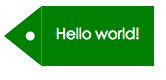
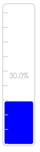

# react-visual-graphic

react visual graphic collections.

## Quick example

## Tag



```js
"use strict";

var React = require('react');
var ReactDOM = require('react-dom');

var Tag = require('react-visual-graphic').Tag;

// Example
(function() {

  ReactDOM.render(
    <div>
      <svg width= {300} height= {300}>
        <Tag
          width= {200}
          height= {80}
          text= {"Hello world!"}
          color= {"green"}
          textColor= {"#FFF"}
          />
      </svg>
    </div>
  , document.getElementById('blank-tag')
  )
})()
```

## Battery


```js
"use strict";

var React = require('react');
var ReactDOM = require('react-dom');

var Battery = require('react-visual-graphic').Battery;

// Example
(function() {

  ReactDOM.render(
    <div>
      <svg width= {300} height= {300}>
        <Battery
          width= {200}
          height= {100}
          maxVal= {100}
          value= {30}
          color= {"green"}
          batteryColor= {"#CCC"}
          />
      </svg>
    </div>
  , document.getElementById('blank-battery')
  )
})()
```

## Meter



```js
"use strict";

var React = require('react');
var ReactDOM = require('react-dom');

var Meter = require('../../lib/index').Meter;

// Example
(function() {

  ReactDOM.render(
    <div>
      <svg width= {300} height= {400}>
        <Meter
          width= {150}
          height= {400}
          maxVal= {100}
          value= {30}
          color= {"blue"}
          meterColor= {"#CCC"}
          text= {"30%"}
          />
      </svg>
    </div>
  , document.getElementById('blank-meter')
  )
})()

```

## License

Apache 2.0
